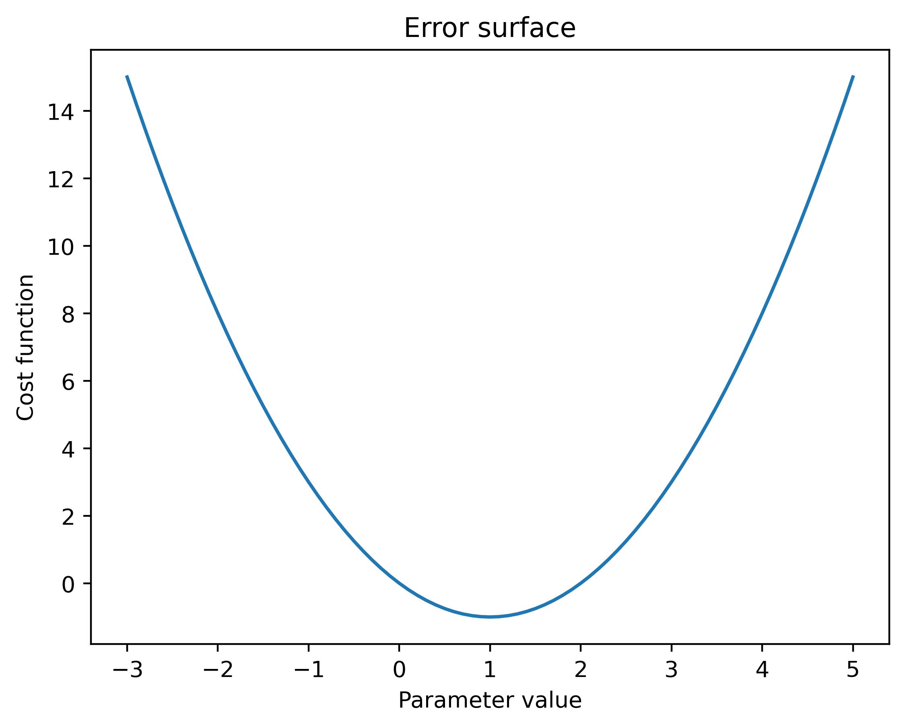
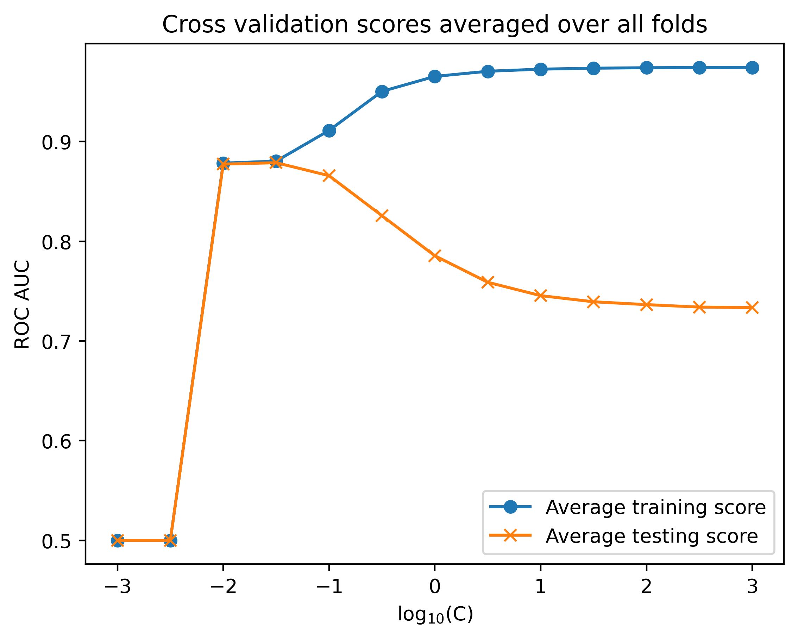

# Projeto 4 — Ridge Regression e Regularização

Regularização L2 (Ridge) aplicada a dados sintéticos e ao dataset real de cartões de crédito, com varredura do parâmetro de regularização `C` e validação cruzada de 10 folds.

**Fonte do projeto:** livro *Projetos de Ciência de Dados com Python* — Stephen Klosterman (Novatec Editora, 2020), Lição 4.

## Metodologia

1. **Dados sintéticos:** geração de dados lineares com e sem outlier para demonstrar o efeito da regularização (polinômios de alta ordem com ridge).
2. **Dados reais:** UCI Credit Card (5.333 registros, 23 variáveis).
3. **Varredura de C:** `C ∈ {0.1, 0.01, 0.001}` (regularização decrescente) com **10-fold cross-validation**.
4. **Avaliação:** AUC médio dos folds de treino e teste para cada valor de `C`.

## Resultados

- Melhor configuração: **C = 0.001**, com **AUC médio ≈ 0.733–0.739** — salto significativo sobre a regressão logística sem regularização (AUC ≈ 0.627).
- A curva AUC × C mostra o trade-off clássico: regularização forte limita o modelo; regularização fraca permite capturar mais sinal, com risco de sobreajuste.





## Estrutura do repositório

| Caminho | Conteúdo |
|---|---|
| `ridge_regularizacao.ipynb` | Notebook completo, já executado |
| `Data/` | Datasets do projeto (UCI Credit Card) |
| `img/` | Figuras extraídas do notebook |

## Como executar

```bash
pip install pandas numpy matplotlib seaborn scikit-learn xlrd
jupyter notebook ridge_regularizacao.ipynb
```

## Dependências

`pandas 1.5.3`, `numpy 1.24.4`, `scikit-learn 1.3.2`, `matplotlib 3.7.5`, `seaborn 0.13.2`
